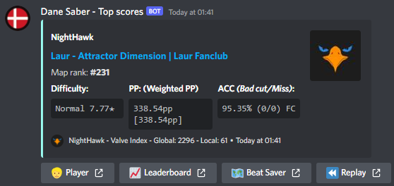

# ScoreFeedJS
The Scorefeed-code originally made for #scores-feed on Dane Saber Discord
 

# What is this?

To put it simply, ScoreFeedJS hooks into the ScoreSaber Websocket for their [Scores-page](https://scoresaber.com/scores), and with some configuration, it posts the desired scores to a Discord-textchannel:  

# How to run

Run `npm install` in `ScoreFeed`

Configure `.env` in `ScoreFeed`

Run `npm start` in `ScoreFeed`

# Why doesn't my buttons show?

Use a webhook generated by a **BOT**, else they won't show. [Guide here](https://hookdeck.com/webhooks/platforms/tutorial-how-to-configure-discord-webhooks-using-the-api)

# Data-structure recieved from the [ScoreSaber WebSocket](./WSDataStructure.json)
