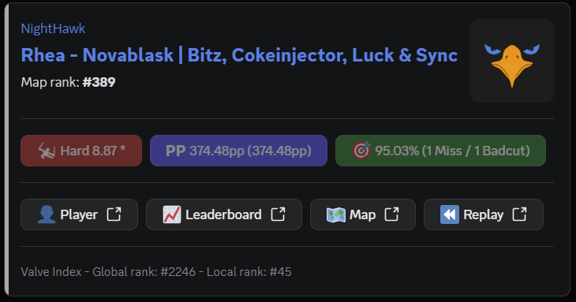

# ScoreFeed_TS
The TypeScript-version of ScoreFeed
 

# READ ME FIRST, PLEASE!
> [!CAUTION]
> Due to the way that components work on Discord-messages, you **need** a Discord-webhook created by a Discord application.  
> If you **DON'T** use an application created webhook you will encounter the following problems, maybe others:  
>  
> V1 version (JavaScript): Buttons will **NOT** be functional or fully missing.
> V2 version (JavaScript/TypeScript): The message will be fully missing.  
>  
> So how do I solve this?
>   
> There's a [guide here](https://web.archive.org/web/20250212204907/https://hookdeck.com/webhooks/platforms/tutorial-how-to-configure-discord-webhooks-using-the-api), on how to create the webhook you need.

After reading this, and you still can't get it to work, feel free to raise an issue, and I will see what I can do to help.  

In the issue, please state what you have already done, and what problem you're facing, thank you!

## Example

# How to run

Run `npm install` or `yarn` in the `ScoreFeed_TS`-folder

Configure `.env`

Run `npm run prod` or `yarn prod` in the `ScoreFeed_TS`-folder

# Data recieved from the [ScoreSaber WebSocket](./WSDataStructure.json)
